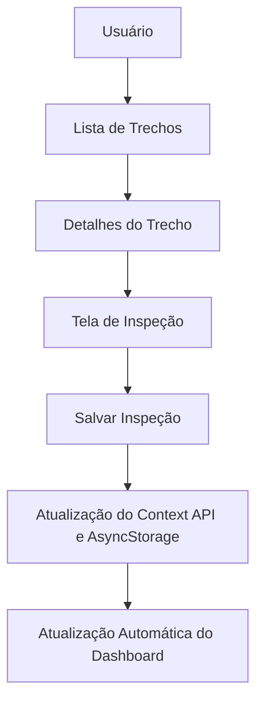

# Banner

## Motiva ORION Mobile

**Operational Roadside Intelligence & Optimization Network**

Aplicação móvel corporativa para apoio operacional às equipes de campo da CCR Motiva, voltada ao monitoramento de trechos, registro de inspeções e acompanhamento da vegetação rodoviária com foco em agilidade, rastreabilidade e decisão operacional.

---

# Visão Geral

A manutenção da vegetação rodoviária exige monitoramento contínuo, resposta rápida e padronização na coleta de informações em campo. Na operação real, pequenos atrasos na identificação de crescimento excessivo, obstrução de visibilidade ou interferências na faixa de domínio podem evoluir para riscos operacionais, retrabalho e impacto direto na segurança viária.

As inspeções em campo também apresentam desafios recorrentes: conectividade instável, necessidade de registro rápido, evidência fotográfica, padronização de status e consolidação das informações para acompanhamento gerencial.

O Motiva ORION Mobile foi estruturado para reduzir essa fricção operacional. A solução centraliza a visualização dos trechos, organiza a priorização dos pontos críticos, permite o registro de inspeções com observação e imagem, e mantém a base local sincronizada para atualização automática da visão executiva no dashboard.

---

# Objetivo

O objetivo da aplicação é apoiar a rotina operacional das equipes de campo com uma interface objetiva e profissional para:

- Registrar inspeções em trechos monitorados.
- Acompanhar o status operacional da vegetação rodoviária.
- Consultar trechos com prioridade e criticidade.
- Atualizar informações de forma consistente para suporte à tomada de decisão.

---

# Funcionalidades

## Dashboard

- Indicadores operacionais consolidados.
- Visão de trechos normais, em atenção e críticos.
- Destaque para ocorrências e última atividade registrada.
- Acesso rápido aos fluxos principais da operação.

## Trechos

- Lista de trechos monitorados da malha.
- Status operacional por faixa.
- Prioridade de intervenção.
- Acesso aos detalhes do trecho e ao fluxo de inspeção.

## Inspeções

- Registro estruturado de inspeções.
- Campo para observações operacionais.
- Captura de evidências fotográficas com Expo Camera.
- Persistência local e atualização automática da interface.

## Persistência

- Context API para estado global da aplicação.
- AsyncStorage para armazenamento local das inspeções.
- Atualização automática do dashboard após o salvamento.

---

# Fluxo da Aplicação



---

# Tecnologias

## Frontend

- React Native
- Expo
- TypeScript
- React Navigation
- Context API
- AsyncStorage

## Recursos Nativos

- Expo Camera
- Expo Location
  - Base preparada para evolução de georreferenciamento e rotinas de campo.

---

# Estrutura de Pastas

```text
src/
├── components/
├── context/
├── data/
├── features/
│   ├── dashboard/
│   │   └── screens/
│   ├── inspecao/
│   │   └── screens/
│   └── trechos/
│       └── screens/
├── navigation/
├── services/
├── theme/
└── types/
```

## Responsabilidade de cada pasta

- `src/components/`: componentes reutilizáveis de interface, como cards, badges, cabeçalhos e blocos de estatística.
- `src/context/`: estado global da aplicação e integração com persistência local.
- `src/data/`: mocks e bases estáticas para simulação da operação.
- `src/features/`: organização por domínio funcional da aplicação.
  - `dashboard/`: visão executiva e indicadores operacionais.
  - `trechos/`: listagem e detalhamento dos trechos monitorados.
  - `inspecao/`: fluxo de registro operacional e captura de evidência.
- `src/navigation/`: navegação por tabs e stack raiz.
- `src/services/`: serviços de infraestrutura, como armazenamento local.
- `src/theme/`: tokens visuais, paleta e consistência de interface.
- `src/types/`: tipagens centrais do domínio e da navegação.

## Arquivos de raiz

- `app.json`: configuração do app Expo.
- `babel.config.js`: configuração do compilador.
- `index.ts`: ponto de entrada da aplicação.
- `package.json`: dependências, scripts e metadados do projeto.
- `tsconfig.json`: configuração de TypeScript.

---

# Dados Mockados

Os mocks existem para permitir desenvolvimento, demonstração e validação da interface sem dependência imediata de backend ou conectividade externa. Eles simulam uma operação real da CCR Motiva com base em trechos, ocorrências e inspeções com contexto operacional consistente.

## Como foram estruturados

- Dados organizados por domínio.
- Campos alinhados ao uso em campo.
- Status, prioridade e ocorrência representando condições reais de operação.
- Base pensada para evoluir para API e sincronização online.

## Arquivos documentados

- `src/data/trechosMock.ts`
  - Lista de trechos monitorados.
  - Inclui rodovia, km, status, nível de vegetação, última intervenção e prioridade.

- `src/data/ocorrenciasMock.ts`
  - Ocorrências relacionadas à vegetação rodoviária.
  - Simula eventos como roçada pendente, crescimento excessivo e obstrução de visibilidade.

- `src/data/inspecoesMock.ts`
  - Histórico inicial de inspeções para demonstração.
  - Apoia cenários de validação local e futuras cargas iniciais.

---

# Casos de Uso

## 1. Registrar inspeção

O usuário acessa um trecho, abre a tela de inspeção, registra observação, captura uma foto e salva o evento no contexto local.

## 2. Consultar trecho crítico

A equipe identifica rapidamente um trecho com status crítico, avalia a prioridade e entra na tela de detalhes para entender o contexto operacional.

## 3. Atualizar status operacional

Após uma nova inspeção, a aplicação atualiza a lista de registros e recalcula os indicadores do dashboard automaticamente.

## 4. Registrar evidência fotográfica

A inspeção é acompanhada por imagem capturada via câmera nativa, aumentando a rastreabilidade e a qualidade do registro.

---

# Instalação

## 1. Clonar o repositório

```bash
git clone <URL_DO_REPOSITORIO>
cd motiva-orion-mobile
```

## 2. Instalar dependências

```bash
npm install
```

## 3. Iniciar o projeto

```bash
npx expo start
```

## 4. Executar no Android

Para emulador Android Studio ou dispositivo conectado:

```bash
npx expo start --android
```

ou

```bash
npm run android
```

## 5. Executar no iOS

```bash
npx expo start --ios
```

> Observação: execução iOS requer macOS com Xcode instalado.

## 6. Executar na Web

```bash
npx expo start --web
```

---

# Demonstração

## Vídeo Demonstrativo

Link: [ADICIONAR LINK DO YOUTUBE](https://www.youtube.com/watch?v=ADICIONAR-LINK-DO-YOUTUBE)

---

# Capturas de Tela

Substituir os placeholders abaixo pelas imagens reais da aplicação.

- `docs/images/dashboard.png`
- `docs/images/trechos.png`
- `docs/images/inspecao.png`
- `docs/images/camera.png`

---

# Integrantes

- João Victor Alves de Abreu - RM 564946
- Luiz Henrique Barbosa Dias - RM 562399

---

# Roadmap

## Versão Atual

- Navegação
- Dashboard
- Mock de dados
- Registro de inspeções

## Versões Futuras

- Integração com API real
- Backend FastAPI
- PostgreSQL
- Sincronização online
- IA ORION
- Planejamento operacional

---

# Conclusão

O Motiva ORION Mobile representa a camada móvel da plataforma Motiva ORION e foi concebido para apoiar equipes de campo com uma ferramenta prática, consistente e orientada à operação. A solução organiza a coleta de informações, o registro de inspeções e a atualização operacional em tempo real, servindo como base para evolução futura com backend, sincronização online e automações inteligentes.
